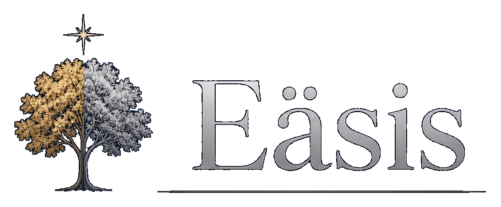

# Eäsis

Eäsis — "Elvish as She is Spoke" — is a personal Android course in Late Quenya. The lexicon, the
attested forms, the phrases, the lesson text, and the lesson order are generated from
[Eldamo](https://eldamo.org), so a lesson teaches what the source attests. A session takes about 15
minutes: the reviews that are due, then the new material, then exercises. The aim is to read the
first 12 lines of *Markirya*, tapping a word to see what it means.

## Install and run

You need JDK 17 or newer, and an Android SDK. The app runs on Android 7.0 and later (`minSdk` 24).

Open this folder in Android Studio and run the `androidApp` configuration. From a terminal, with an
emulator or a device already connected:

```bash
./gradlew :androidApp:installDebug
```

That builds the debug app and installs it over any copy already on the device. The application id
is `app.quenya`.

To build an APK without installing it:

```bash
./gradlew :androidApp:assembleDebug
```

The APK is written to `androidApp/build/outputs/apk/debug/androidApp-debug.apk`.

## Tests

```bash
./gradlew :core:jvmTest
```

Without Gradle, with `kotlinc` and JUnit 4 only:

```bash
KOTLINC_HOME=/path/to/kotlinc ./tools/run_core_tests.sh
```

## Licence

[licence.md](licence.md).
